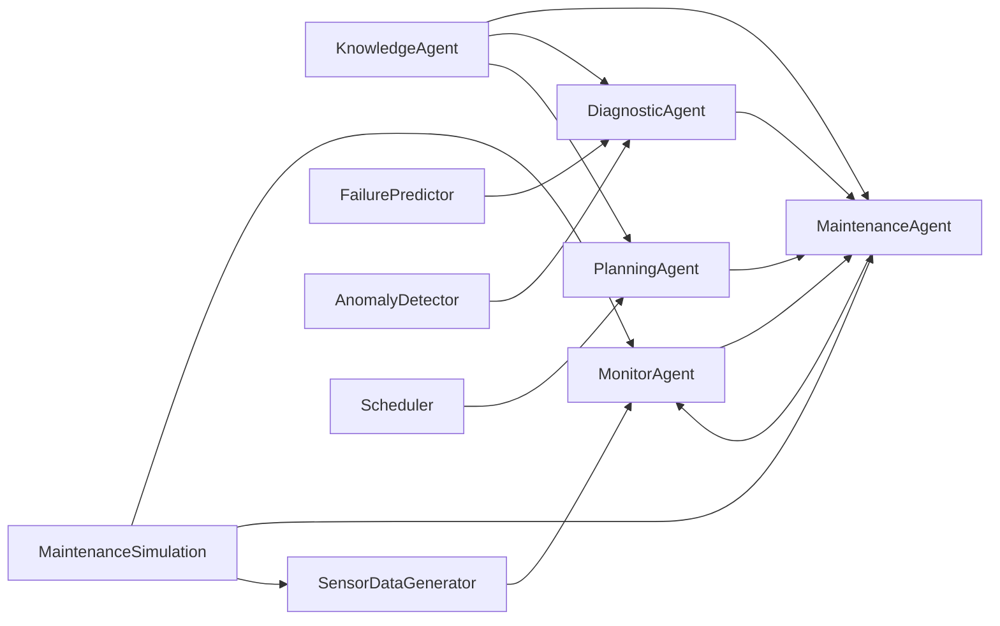

# Multi-Agent Maintenance System Architecture

The multi-agent maintenance system is composed of several key components that work together to monitor equipment health, plan and execute maintenance actions, and optimize the overall maintenance strategy. The following Mermaid diagram illustrates the system's architecture and the interactions between the different components:

**Agents**:
- `MaintenanceAgent`: Responsible for executing maintenance actions, recording maintenance history, and optimizing maintenance strategies.
- `MonitorAgent`: Monitors the health and status of individual equipment units, triggering maintenance requests as needed.
- `KnowledgeAgent`: Maintains a shared understanding of the system's state and provides insights to other agents.
- `DiagnosticAgent`: Analyzes equipment data to detect anomalies and predict failures.
- `PlanningAgent`: Coordinates the maintenance activities and optimizes the overall maintenance plan.

**Simulation**:
- `MaintenanceSimulation`: The central class that orchestrates the simulation, including initializing agents, connecting them, and running the main simulation loop.
- `SensorDataGenerator`: Generates realistic sensor data for the simulated equipment.

**Models**:
- `FailurePredictor`: Predicts the likelihood of equipment failures based on sensor data and historical maintenance records.
- `AnomalyDetector`: Identifies anomalies in equipment behavior that may indicate potential issues.
- `Scheduler`: Optimizes the maintenance schedule based on factors like cost, resources, and priority.

This diagram provides a high-level overview of the multi-agent maintenance system's architecture and the interactions between its key components. It should help new users quickly understand the overall structure and relationships within the system.
